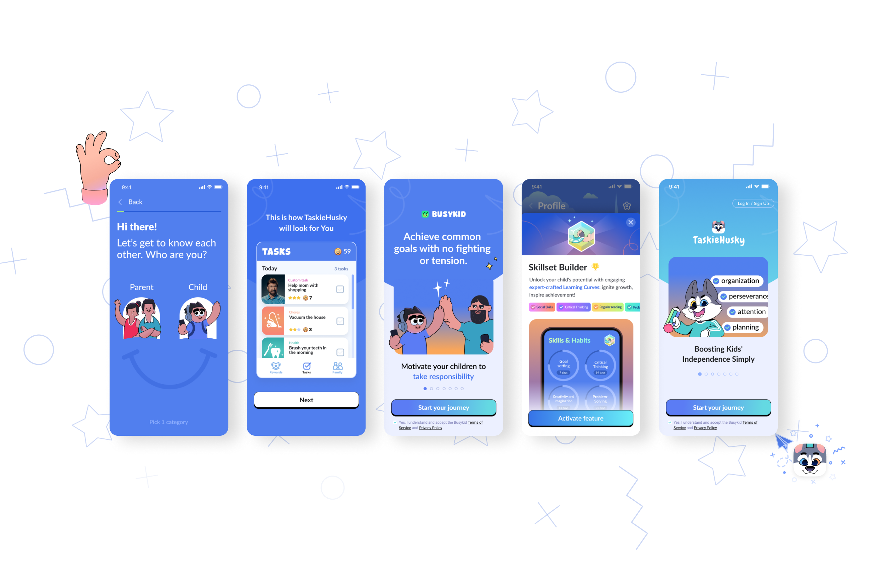
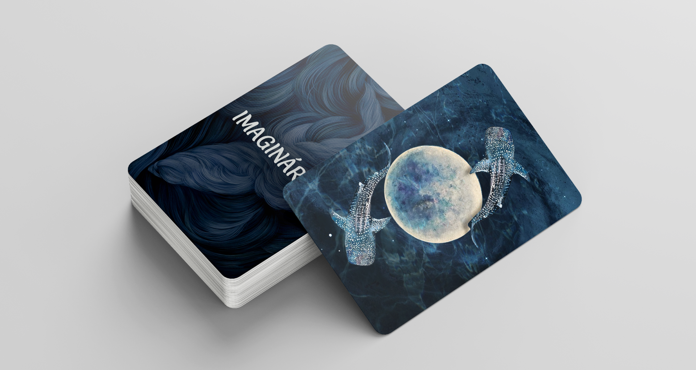
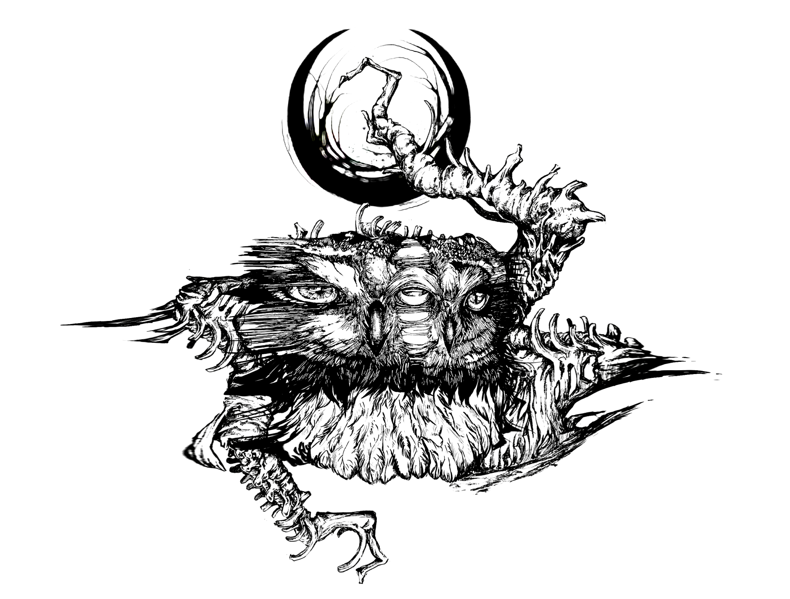
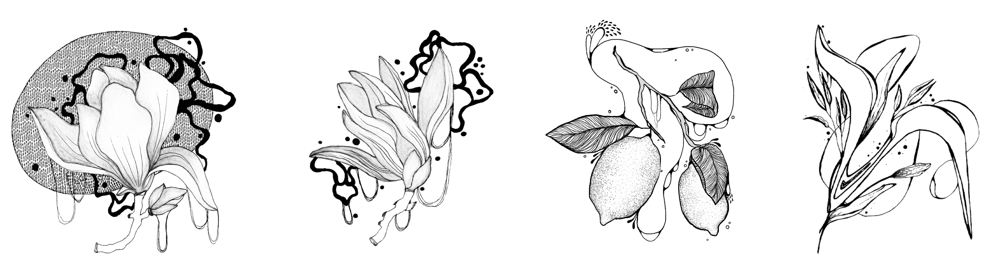

# FIRST IMPRESSION
 

### About me

Hey, this is me! I'm Valery - a multi-skilled Graphic Designer from Prague. I've got a skill for keeping stuff neat and simple, whether it's design or just everyday things. 

I like to bring order into chaos and make things look awesome!

## MY PROJECTS
### APP UI DESIGN 

Taskie Husky is a gamified To-do & Productivity App for parents that helps motivate their kids to do daily chores, acquire positive habits, get self-organization skills, do their homework, and take responsibility. Give your child tasks and choose rewards. The app will do the rest. 

• You choose tasks to focus on.
Create your own tasks or choose a few focus areas for Taskie Husky to recommend exciting activities.

• Your child starts playing.
They’ll earn points and achievements for completing tasks and chores.

• You keep track of their progress.
Every time they claim a task is completed, you’ll receive a notification to approve it.

• You choose exciting rewards.
Encourage and reward your child for completing chores and tasks.

• Your child builds habits while having fun.
Celebrate their progress and receive detailed weekly reports.

---
### BOARD GAME 

The game "Imaginarium" is an extension of a popular board game, but with a cool ocean theme. It is a visual game, specially designed to use your imagination for 100%. The goal is not just to have fun and use your imagination but also to learn more about your friends. 
The cards have colorful pictures of things like underwater life, landscapes, and ocean stuff. Each game round takes about 30 minutes.
The game can be replayed as many times as you want

---
### TATTOO SKETCHES

Mainly, I position myself as a graphic designer, but in order not to get bogged down in endless wireframes, I sometimes draw custom tattoos and illustrations.  

