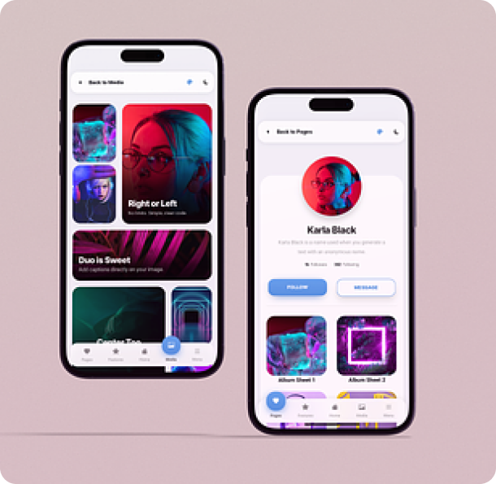

Since lately I've been diving deep into UI/UX design because of my thesis and work, I'm excited to share seven game-changing solutions that can help mobile apps stand out in a sea of competitors. The market is flooded with options. It's crucial to catch users' attention and set yourself apart. 
After all, the design of a mobile app is their first impression of a product and how users interact with it.

<h3> So, what can you do to make your app's interface top-notch? </h3>
 

**Neomorphism and flat design**

Neomorphism gives the interface volume and realism makes elements pop out like they're ready to leap off the screen.. The main idea is to create the effect of “convexity” of the elements, giving them volume and depth. Shadows, lights, gradients and textures are becoming the main tools in interface design. Flat design focuses on minimalism. It removes bulk for simple shapes and vibrant colors. Flat design simplifies the interface and makes it more understandable for users. This doesn't mean it has to be boring or lack character.  With the right colors, fonts, and icons, it becomes stylish and attractive. 

Nowadays, these two approaches are often intertwined. Some use neomorphism to add depth. The rest of the interface can be flat. This lets you create a harmonious and interesting design. It is both attractive and easy for users to understand.

 

**Experimental typography and non-standard text alignment**

Classic left alignment can feel common and boring. So, experimental typography offers new ways to do text layout and alignment.

The alignment can be non-standard. It can be symmetrical, with variations up or across. This creates interesting and unexpected effects. This lets developers design dynamic and unique interfaces. These interfaces attract attention and make the user experience emotional and memorable.

By placing text in odd places, you can make comfy spots for the user's eyes. This makes it easy to interact with the content. But, non-standard text and experimental typography can also be a challenge. They need careful design. This design must consider the text's readability and how it will look on different devices and screens.

 

**Asymmetry**

Symmetrical design has elements evenly on both sides. Asymmetry lets you make more dynamic and non-standard compositions. Asymmetry helps show the visual priorities and order of info in the app. It draws the user's eye to the main functions or key info. The size, color, and position of objects can serve as tools that help emphasize the importance of certain interface elements.

 

**Full-screen immersive graphics**

It allows users to be completely immersed in the virtual space displayed on the screen.
The main goal of full-screen immersion is to create a feeling of presence. It aims to maximize interaction between the virtual world and reality. This is done by using the large screens of mobile devices. They can show rich, detailed scenes with high-quality visuals, animations, and motion.

Choosing the right graphics for full screen is important. It is a key part of successful design. It should convey atmosphere and context. Displayed images can influence emotions and create a special atmosphere of user interaction.

Full-screen immersive graphics need to be used correctly so they don't become a barrier to users. Don't put too much on the screen. Avoid navigation elements. They can distract from the main content. It is important to strike a balance between visual appeal and ease of use.

<i>However, it's important to analyze each case. You must consider if using a specific method is appropriate. Overloading the interface could harm user interaction with the content.
So, it's important to get just the right balance.</i>
