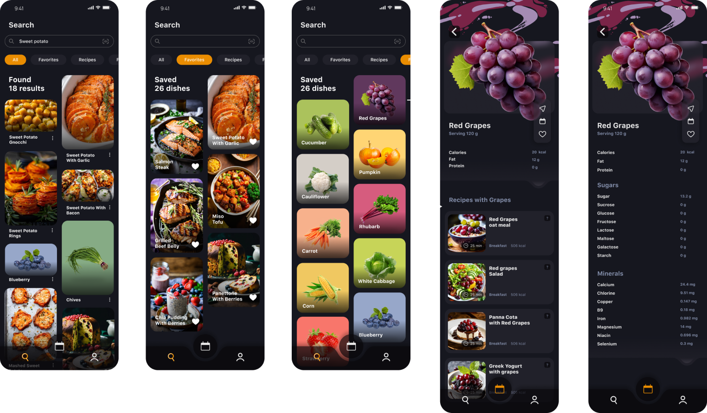

### Design and implementation of a visual interface for a mobile application to support a healthy lifestyle 

### “Put your diet on autopilot”
Eat This Much creates personalized meal plans based on your food preferences, budget, and schedule.

I have been using Eat This Much for a few years. When it was time to choose a thesis topic, this app came to my mind. The app has a lot of cool features, but the design itself looks just like a plain unstilled HTML page. At first, I was interested in the design, but already at the analysis stage I realized that design alone wouldn’t do the “trick”. That's why I decided to redo everything in this app. 

I began with an in-depth study of the app's philosophy and its development process. After I collected all the information I needed, I started making the first low-fi wireframes of what the application could look like. Looking back, I'm a bit embarrassed by those early attempts. But, they still looked better than the original app. After I understood the right way to design, the work went pretty quickly. I was initially optimistic about finishing earlier than expected, but my perfectionism destroyed those crystal castles. 

I spent about a month on details that in the end turned out to be not even that important for finalizing the project. I could spend hours choosing the right background shade, and the perfect button radius, or spend half a day playing with UI elements as if they were Lego blocks. At some point, it seemed to me that I was trying to assemble a fighter aircraft from the “Daisy” model kit.

After a month of chill work, I realized that time was running out and it is time to speed up. But here comes another common problem for designers - a burnout. So I took a short break to rest my eyes and mind. It was the right call. After that, I somehow finished all the work in just a couple of nights and even helped my classmate with their thesis. 

At first, before any thesis research, I could hardly imagine writing 10 pages. A few months later, I took a 70-page thesis from the copy studio. Even now after submitting it still feels surreal. 

I think the project has a good chance of being realized by the development team,  for now we are still at the negotiation stage.

**User flow:**

I think that right after the dull design, this was the second huge problem of this app. You could literally get lost in the old user flow, so this was the first thing I completely redid.
 

**Key elements:**

Throughout  time working on the project, I developed a new logo, new typography and emphasized the aspect of food and healthy eating with a new color palette.

 

**Communication:**

I replaced the flat machine-like language with a more playful and ironic one. This made the person feel like he was talking to a friend, not a machine.

**Marketing:**

I thought that regular food photos would no longer surprise anyone. So, colorful 2D illustrations replaced them. This helped show the app's playfulness. After all, healthy food doesn’t have to be boring. 

 

    

    

    

    

    

And of course, for fans of  burned out eyes at night, I also made a light mode.  (and yes it was done at the last minute)

    

    

    

